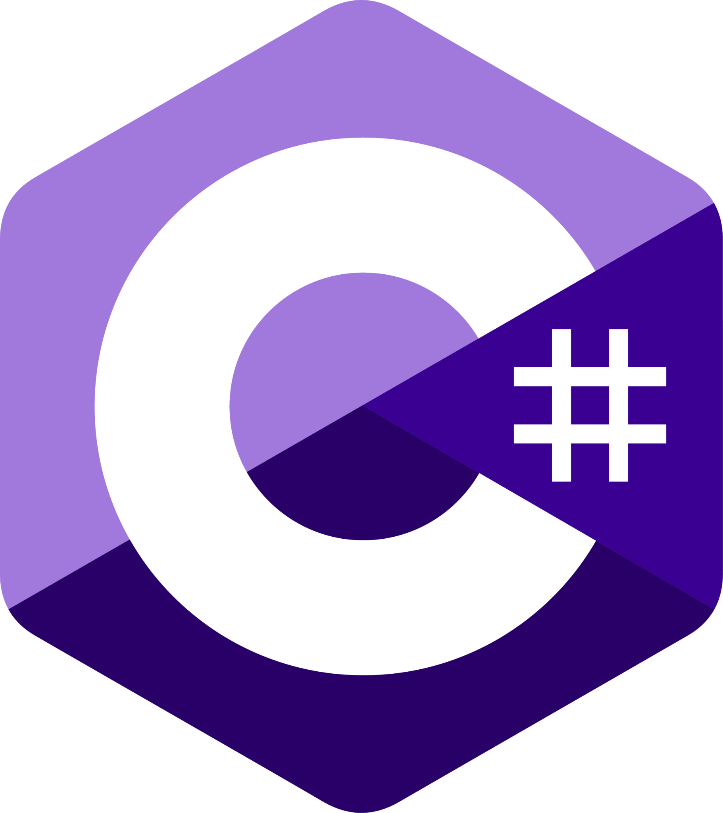

# Hi everyone! ✨👋 I'm **Fatima**

Welcome to my little corner of GitHub! 

Currently, I'm excitedly taking my first steps and exploring the fascinating world of **Cybersecurity** 🛡️🔒 with tons of curiosity. Always ready to learn something new and help protect the digital realm! 🦸‍♀️

---

### 
My Tech Toolkit 💖

 

  &nbsp&nbsp&nbsp&nbsp
  &nbsp&nbsp&nbsp&nbsp
  &nbsp&nbsp&nbsp&nbsp  
  &nbsp&nbsp&nbsp&nbsp  
  &nbsp&nbsp&nbsp&nbsp  
  &nbsp&nbsp&nbsp&nbsp  
  &nbsp&nbsp&nbsp&nbsp  
  &nbsp&nbsp&nbsp&nbsp  
    

 

   HTML * CSS * Tailwind CSS * JavaScript * Node.js * Express * Python * C# * .NET 

---

 

Thanks for stopping by my profile! 🌸💖

